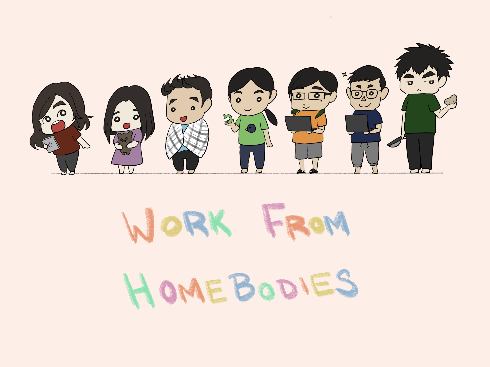

Bouncies
--------

In the great Coronavirus Quarantine of 2020, we can only be together digitally.

**Bouncies** is a digital playground with all of us "Work from Home-bodies" as rigid bodies in a physics engine. Play here: https://kevinychen.github.io/bouncies/.

Credits to Eva Yeung for artwork!

Development
===========

Run

    npm run start

and visit http://localhost:8080.

Before pushing, make sure to:

1. Make a trivial change in `index.html` (e.g. increment the version number) so that Github Pages re-builds the assets.
1. Run `npm run build` and commit the generated `index.js` file.

